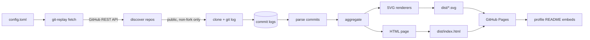

# git-replay

Animated git-history replay widgets — commit replays, heatmaps, per-repo bars, and
agent-authorship stat tiles rendered as self-animating SVGs for GitHub profile READMEs,
plus a full interactive HTML page deployed to GitHub Pages.

> **Skeleton stage.** The data pipeline and SVG renderers have landed; the interactive
> page ([#14][i14]) and the Pages deploy workflow ([#15][i15]) are in flight. Until
> [#15][i15] merges, the Pages URLs below are not yet live.

## What it is

One data pipeline feeds two render targets from the same aggregated commit history (see
[ADR 0001][adr1]):

1. **SVG widgets** — self-contained, **pure-CSS-animated** SVGs (no JavaScript, no
   SMIL). GitHub READMEs strip JavaScript and serve images through the camo proxy, so
   CSS animation is what lets the widgets play when embedded as ``. camo caches the
   bytes, so a rebuilt widget appears after its cache expires — a staleness window that
   is accepted by design.
2. **HTML page** — the full interactive replay (JavaScript playhead, live per-repo
   counters, hover tooltips, `prefers-reduced-motion` fallback) on GitHub Pages. The
   README images link through to it.

Data covers the **public, non-fork** repositories of the configured owners, refreshed
twice weekly by CI. Private and fork repositories are excluded at the source, in fetch
code, regardless of configuration.

## Widgets

Embed the widgets in a profile README as images. Each is deployed to GitHub Pages by
[#15][i15] (not yet live):

```markdown


```

| Widget      | URL                                                     | Animated |
| ----------- | ------------------------------------------------------- | -------- |
| Replay bars | `https://turbocoder13.github.io/git-replay/replay.svg`  | Yes      |
| Heatmap     | `https://turbocoder13.github.io/git-replay/heatmap.svg` | No       |
| Top repos   | `https://turbocoder13.github.io/git-replay/repos.svg`   | No       |
| Stat tile   | `https://turbocoder13.github.io/git-replay/stat.svg`    | No       |

The **stat tile** reports the share of **agent-authored** commits: commits authored by
Claude Code under human direction, with the remainder attributed to service bots
(renovate, github-actions, release bots).

## Architecture



Renderers own presentation only; the shared aggregation layer keeps the SVG teaser and
the HTML page from ever disagreeing about the numbers. The `build` command and the HTML
page arrive with [#14][i14]; the Pages deploy with [#15][i15].

## Configuration

Fetching is driven by `config.toml`:

```toml
# Owners whose public, non-fork repositories are replayed.
owners = ["TurboCoder13", "lgtm-hq"]

# Repository names to skip during discovery.
exclude = ["ui-framework", "spotify-curator"]

# Map author display names to a canonical identity.
[alias_map]
"Turbo Coder" = "TurboCoder13"
"Eitel" = "TurboCoder13"
"Eitel Ashley Dagnin" = "TurboCoder13"
```

| Key         | Type             | Meaning                                   |
| ----------- | ---------------- | ----------------------------------------- |
| `owners`    | list of strings  | GitHub logins whose repos are discovered  |
| `exclude`   | list of strings  | Repository names skipped during discovery |
| `alias_map` | table of strings | Maps author display names to one identity |

The private/fork exclusion is **not** configurable — it is enforced unconditionally in
fetch code. `exclude` only skips additional public repos.

## Token setup (`GH_REPLAY_TOKEN`)

Fetching authenticates to the GitHub REST API to avoid rate limits and to read across
both owners. CI uses a **fine-grained personal access token** stored as the repository
secret `GH_REPLAY_TOKEN`.

Create the PAT with:

- **Resource owners:** `TurboCoder13` and `lgtm-hq`
- **Repository access:** all repositories (or all public ones)
- **Permissions:** `Contents` → **Read-only**, `Metadata` → **Read-only**

Then store it as a repository secret:

```bash
gh secret set GH_REPLAY_TOKEN --repo TurboCoder13/git-replay
```

The deploy workflow ([#15][i15]) exposes this secret to the fetch step as the `GH_TOKEN`
environment variable, which `git-replay fetch` reads as a bearer token. **Rotate** the
PAT before its expiry and re-run the `gh secret set` command above. For local runs,
export your own token:

```bash
export GH_TOKEN="github_pat_..."
```

## Local development

Requires Python 3.11+ and [uv](https://docs.astral.sh/uv/).

```bash
uv sync                                    # install dependencies

# fetch commit logs for the configured owners
uv run git-replay fetch --config config.toml --out logs

uv run git-replay build --out dist         # render widgets + page (#14)

uv run lintro chk                          # lint
uv run lintro fmt                          # format
uv run pytest                              # tests with coverage
```

The `build` command lands with [#14][i14]. `dist/` is a build artifact and is never
committed — publishing is Pages-artifact-only.

## Documentation

- [ADR 0001: Two render targets from one data pipeline][adr1]
- [CONTRIBUTING.md](CONTRIBUTING.md)
- [SECURITY.md](SECURITY.md)

[adr1]: docs/adr/0001-render-targets.md
[i14]: https://github.com/TurboCoder13/git-replay/issues/14
[i15]: https://github.com/TurboCoder13/git-replay/issues/15
